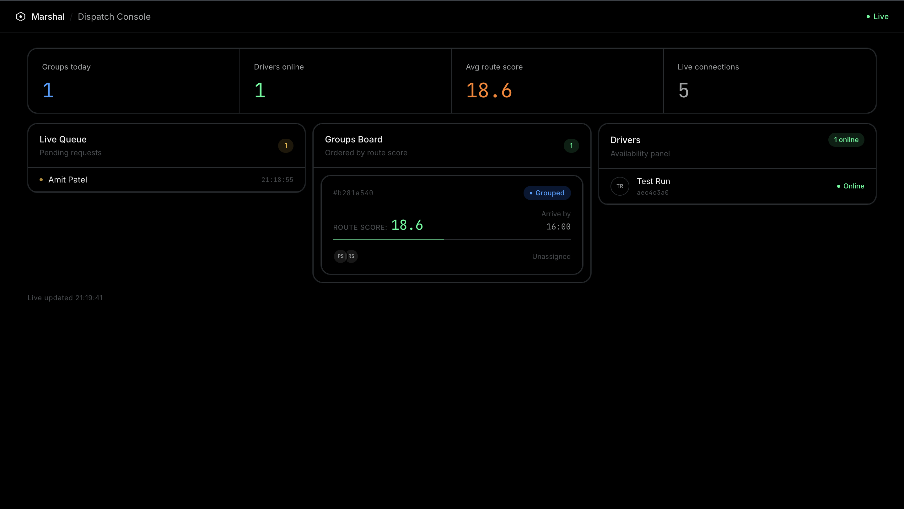
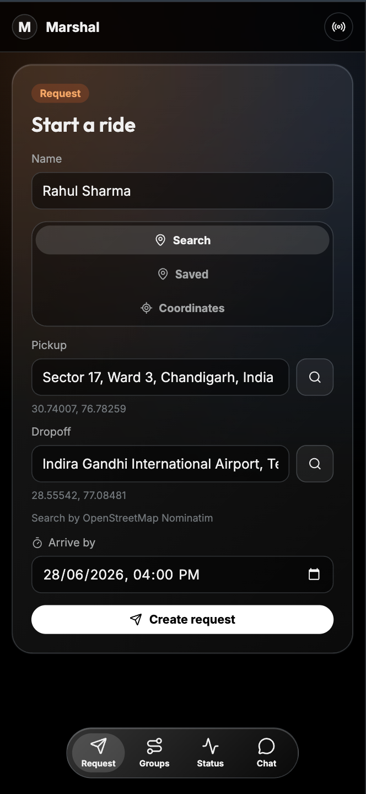
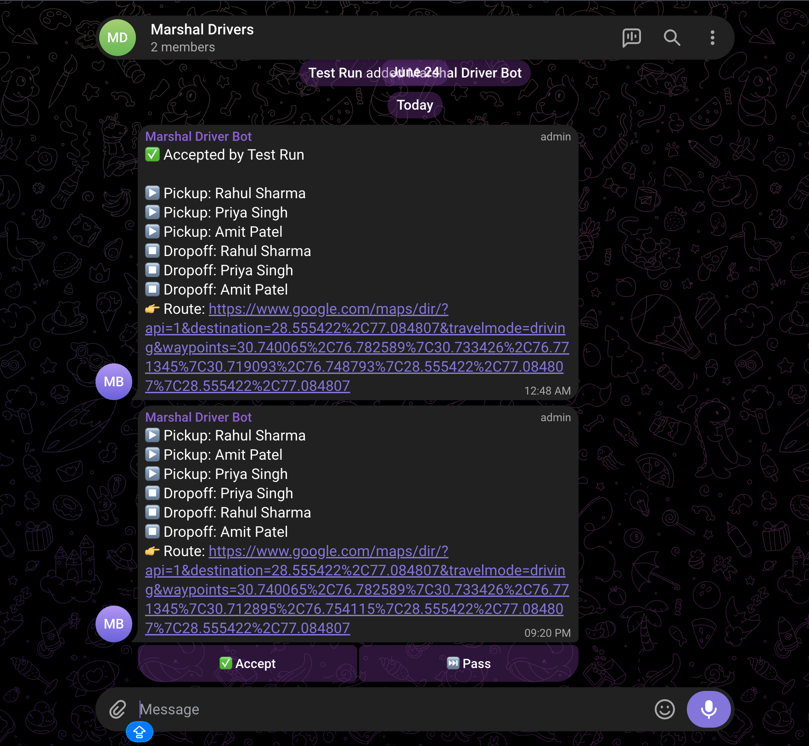
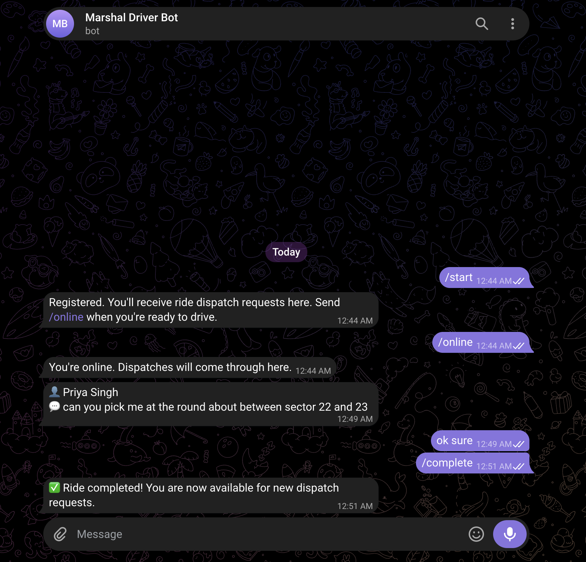

# Marshal

> *Historically translating to "keeper of the horses," a Marshal brings order to the chaos of movement—just as this engine organizes, routes, and dispatches campus transport with precision.*

**Ride-grouping and dispatch engine for campus transport.** Students request rides; Marshal spatially clusters them in real time, scores the groups, and dispatches a driver via Telegram — all while both sides watch status update live.

| Student App | Admin Console |
|---|---|
| [marshal-student.vercel.app](#) | [marshal-admin.vercel.app](#) |


---

## Screenshots


*Dispatch Console — live queue, groups board, and driver availability panel*


*Student App — request form with OpenStreetMap Nominatim location search*

### Telegram Driver/Bot Interface

| Telegram Group Chat | Telegram Personal Chat |
|---|---|
|  |  |

---

## How It Works

```
Student submits request
        │
        ▼
  ┌─────────────────┐
  │   ride_requests │  status: pending
  └────────┬────────┘
           │  Grouper worker (H3 spatial bucketing)
           ▼
  ┌─────────────────┐
  │   ride_groups   │  status: grouped  ◄── admin dashboard updates live (SSE)
  └────────┬────────┘
           │  Assigner worker (priority queue by route_score)
           ▼
  Telegram → Driver group chat (inline Accept / Pass buttons)
           │
           │  Driver taps Accept
           ▼
  ┌─────────────────┐
  │   ride_groups   │  status: assigned  ◄── student status stepper updates live (WS)
  └────────┬────────┘
           │
           ▼
  Student ↔ Driver chat (WebSocket relay via Telegram)
```

### Ride lifecycle: Requested → Grouped → Dispatching → Assigned

A student submits name, pickup, dropoff, and an arrive-by time. The grouper worker runs on a 30-second tick (or woken immediately by `LISTEN/NOTIFY`) and buckets pending requests into H3 cells at resolution 9 (~0.1 km²). It runs three passes — exact cell, neighbouring cells, relaxed — and scores each candidate group on pickup spread, dropoff spread, and time-window overlap. The highest-scoring groups are written to `ride_groups` and a realtime event fans out to every connected admin and student.

The assigner then pulls the best-scored group from a Postgres priority queue (`FOR UPDATE SKIP LOCKED`) and dispatches it to the Telegram driver group. A driver taps Accept or Pass on the inline keyboard. Accept assigns the group and relays that back to the student app. Pass returns the group to the pool for re-dispatch (with increasing backoff).

See `docs/diagrams/` for Excalidraw source and the [backend README](backend/README.md) for the full system architecture diagram.

---

## Architecture Overview

```text
┌──────────────────────────────────────────────────────────────────────┐
│                             VERCEL (2×)                              │
│                                                                      │
│   frontend/student            frontend/admin                         │
│   (Vite + React + Tailwind)   (Vite + React + Tailwind)              │
│      WS /ws  ◄───────────────────────────────────────────────────┐   │
│      SSE /events ◄────────────────────────────────────────────┐  │   │
└──────────┬─────────────────────┬──────────────────────────────│──│───┘
           │ REST /api/*         │ REST /api/*                  │  │
           ▼                     ▼                              │  │
┌──────────┴─────────────────────┴──────────────────────────────│──│───┐
│                        RENDER (Docker)                        │  │   │
│                                                               │  │   │
│   ┌────────────────────────────────────────────────────────┐  │  │   │
│   │  Go HTTP server  (net/http, stdlib only)               │  │  │   │
│   │                                                        │  │  │   │
│   │  Handlers ──► Grouper ──► H3 spatial bucketing         │  │  │   │
│   │           ──► Assigner ──► Postgres priority queue     │  │  │   │
│   │           ──► Worker   ──► LISTEN/NOTIFY wakeup        │  │  │   │
│   │           ──► Realtime Hub ──► WS clients ─────────────┘  │  │   │
│   │                          ──► SSE clients ─────────────────┘  │   │
│   │           ──► Telegram Bot ──► driver group ◄── webhook      │   │
│   └────────────────────────────────────────────────────────┘     │   │
│                                                                  │   │
│   ┌─────────────────┐                                            │   │
│   │  PostgreSQL     │  ride_requests, ride_groups, group_members,│   │
│   │  (Managed)      │  drivers, jobs, chat_messages              │   │
│   └─────────────────┘                                            │   │
└──────────────────────────────────────────────────────────────────────┘
                              │
                              ▼
                     Telegram Bot API
                     (webhook in prod, polling in dev)
```


---

## Tech Stack

| Layer | Technology |
|---|---|
| Backend | Go 1.25 (stdlib `net/http`) |
| Database | PostgreSQL 16 (pgx/v5) |
| Spatial indexing | H3 (Uber, resolution 9) |
| Real-time | WebSocket (gorilla/websocket) + SSE |
| Telegram dispatch | Telegram Bot API (webhook + polling fallback) |
| Student frontend | Vite + React + Tailwind CSS |
| Admin frontend | Vite + React + Tailwind CSS |
| Hosting | Render (Docker, backend) · Vercel ×2 (frontends) |
| CI | GitHub Actions (go vet, integration tests, 40% coverage gate) |

---

## Repo Layout

```
Marshal/
├── backend/                  Go API server — grouper, assigner, realtime, Telegram bot
│   ├── cmd/marshal/          main.go — routes and server bootstrap
│   ├── internal/
│   │   ├── grouper/          H3 bucketing, scoring, re-ranking
│   │   ├── assigner/         priority-queue dispatch engine
│   │   ├── worker/           Postgres job queue + LISTEN/NOTIFY
│   │   ├── realtime/         WebSocket hub with rooms
│   │   ├── sse/              SSE fan-out adapter
│   │   ├── telegram/         bot, webhook, polling, inline keyboard
│   │   ├── handlers/         HTTP handlers
│   │   ├── store/            Postgres store layer
│   │   └── models/           shared domain types
│   └── migrations/           .up.sql / .down.sql
├── frontend/
│   ├── admin/                Dispatch Console (Vite + React)
│   └── student/              Student PWA (Vite + React, mobile-first)
├── docs/
│   ├── diagrams/             Excalidraw source + exported PNGs
│   └── screenshots/          App screenshots for README embeds
└── docker-compose.yaml       Local Postgres for development
```

→ [Backend README](backend/README.md) — API reference, env vars, local setup, testing  
→ [Admin Frontend README](frontend/admin/README.md) — dispatch console  
→ [Student Frontend README](frontend/student/README.md) — student PWA  

---

## Local Development (Quick Start)

**Prerequisites:** Go 1.25, Node 20, Docker, `golang-migrate` CLI

```bash
# 1. Start Postgres
docker-compose up -d

# 2. Backend
cd backend
cp .env.example .env          # fill in TELEGRAM_BOT_TOKEN etc.
make migrate-up
make run

# 3. Student frontend (new terminal)
cd frontend/student
cp .env.example .env.local
npm install && npm run dev     # → http://localhost:5173

# 4. Admin frontend (new terminal)
cd frontend/admin
cp .env.example .env.local
npm install && npm run dev     # → http://localhost:5174
```

For Telegram testing in local dev, set `TELEGRAM_WEBHOOK_URL` to your ngrok URL or leave it blank to use polling.

---


## Testing

```bash
cd backend
make test-unit          # pure unit tests, no DB required
make test-integration   # integration tests (needs Postgres via docker-compose)
make check-coverage     # filtered coverage gate (threshold: 40%)
```

Coverage is gated in CI: the build fails if filtered coverage falls below 40%. The filter excludes `cmd/`, `internal/api/`, and `internal/config/` (pure boilerplate) to keep the metric signal-ful.

---

## Security Notes

- **Admin key** — driver registration is gated behind `X-Admin-Key`; constant-time comparison prevents timing attacks. If `ADMIN_API_KEY` is unset, the endpoint returns `503` (fail-closed, not open).
- **Telegram webhook** — validated with `X-Telegram-Bot-Api-Secret-Token` before processing.
- **Rate limiting** — per-IP token bucket (10 requests / 3 s) on all mutation endpoints.
- **CORS** — origin allowlist via `ALLOWED_ORIGIN`; multiple origins supported as comma-separated list.
