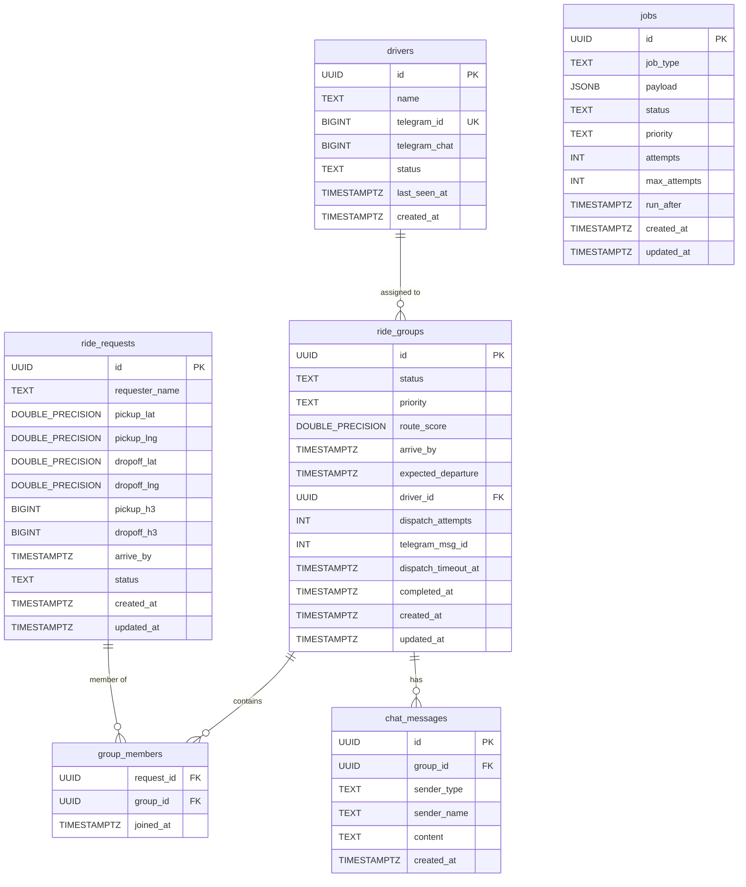

# Marshal — ER Diagram

Entity-relationship diagram derived directly from `backend/migrations/001_create_core_schema.up.sql`.

---

### Key Indexes

| Index | Purpose |
|---|---|
| `idx_requests_status` | Grouper scans `WHERE status = 'pending'` |
| `idx_requests_status_h3` | Grouper H3 cell bucketing |
| `idx_groups_priority_queue` | Assigner max-heap: `(priority_rank, route_score DESC)` WHERE unassigned |
| `idx_jobs_queue` | Worker pull: `run_after ASC` WHERE queued |
| `idx_chat_group_id` | Chat message fetch per group |

---

<!--
EXCALIDRAW FALLBACK
===================
To convert this to an Excalidraw diagram:

1. Open https://app.excalidraw.com
2. Create a new drawing
3. Recreate the tables as rectangles with the fields listed above
4. Draw relationship lines between:
   - drivers.id → ride_groups.driver_id (1:many)
   - ride_requests.id → group_members.request_id (1:many)
   - ride_groups.id → group_members.group_id (1:many)
   - ride_groups.id → chat_messages.group_id (1:many)
5. Use colour #001E2B for table backgrounds, #00ED64 for PK fields
6. Export as PNG → save to docs/diagrams/er-diagram.png
7. Export as .excalidraw → save to docs/diagrams/er-diagram.excalidraw

Then replace the Mermaid block above with:

-->
