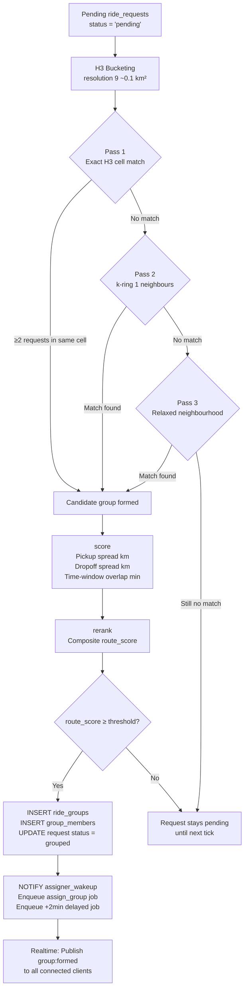

# Marshal — Grouping Algorithm

How the grouper converts pending ride requests into scored groups using H3 spatial indexing.

---

### Score Function (`internal/grouper/score.go`)

The composite `route_score` combines three sub-scores:

| Component | What it measures | Good score = |
|---|---|---|
| Pickup spread | Mean pairwise distance between pickup points | Low (tight cluster) |
| Pickup std dev | Standard deviation of pickups from centroid | Low |
| Dropoff spread | Mean pairwise distance between dropoff points | Low |
| Dropoff std dev | Standard deviation of dropoffs from centroid | Low |
| Time overlap | Standard deviation of arrive_by minutes | Low |

All sub-scores are normalised and combined into a single `float64` between 0 and 1. A higher `route_score` means the group is a better ride-pool fit — shorter detour, tighter time window.

### Re-rank (`internal/grouper/rerank.go`)

After scoring, candidate groups that share members are resolved — only the best-scoring group per member is kept. This prevents one student being placed in two groups simultaneously.

### H3 Resolution

Resolution 9 hexagons have an average area of ~0.1 km² (edge length ~174 m). This means two students whose pickups are within roughly one block will land in the same cell, or adjacent cells (captured in Pass 2). Resolution 9 was chosen as the sweet spot for a campus-scale deployment — tight enough to produce useful groups, loose enough to not leave everyone unmatched.

---

<!--
EXCALIDRAW FALLBACK
===================
To convert this to an Excalidraw flowchart:

1. Open https://app.excalidraw.com
2. Create the flowchart following the Mermaid diagram above
3. Style notes:
   - Input/output boxes: rounded rectangles, bg #001E2B, border #00ED64
   - Decision diamonds: standard diamond shape, bg #1a1a2e
   - Pass 1/2/3 retry loop: show as a visual step-down with labels
   - score() and rerank() boxes: slightly different colour (#0d1b2a) to show they're algorithm steps
   - The final fan-out to Realtime/Assigner: use green arrows
4. Add a small H3 hexagon grid illustration in the top-right corner showing:
   - A center cell (dark fill) and its k-ring-1 neighbours (lighter fill)
   - Label: "H3 resolution 9, ~0.1 km²"
5. Export as PNG → docs/diagrams/grouping-algorithm.png
6. Export as .excalidraw → docs/diagrams/grouping-algorithm.excalidraw

Then replace the Mermaid block above with:

-->
