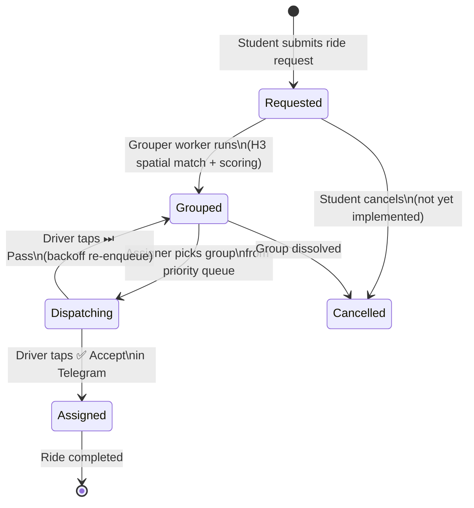

# Marshal — Ride Lifecycle State Machine

All states a `ride_group` or `ride_request` can be in, and the transitions between them.



---

### Status Values

| Entity | Status | Meaning |
|---|---|---|
| `ride_requests` | `pending` | Submitted, awaiting grouper run |
| `ride_requests` | `grouped` | Assigned to a ride_group |
| `ride_groups` | `grouped` | Formed, waiting for assigner |
| `ride_groups` | `dispatching` | Telegram card sent, awaiting driver response |
| `ride_groups` | `assigned` | Driver accepted, ride is live |
| `ride_groups` | `completed` | Ride finished |
| `drivers` | `online` | Active, visible to assigner |
| `drivers` | `offline` | Inactive (TTL-based) |

---

### Student-facing mapping (Status tab in the app)

```
ride_request.status = pending    →  stepper: ① Requested (active)
ride_group.status   = grouped    →  stepper: ② Grouped   (active)
ride_group.status   = dispatching→  stepper: ③ Dispatching (active)
ride_group.status   = assigned   →  stepper: ④ Assigned  (active, green dot)
```

The stepper icons in the student app directly mirror these four states.

---

<!--
EXCALIDRAW FALLBACK
===================
To convert this to an Excalidraw state machine:

1. Open https://app.excalidraw.com
2. Create 4 rounded-rectangle state nodes:
   [Requested] → [Grouped] → [Dispatching] → [Assigned]
3. Add arrows with labels:
   Requested → Grouped:     "Grouper worker (H3 bucketing)"
   Grouped → Dispatching:   "Assigner picks top group"
   Dispatching → Assigned:  "Driver taps Accept (Telegram)"
   Dispatching → Grouped:   "Driver taps Pass (backoff)" (curved back arrow)
4. Add diamond-shaped side states: [Cancelled] with dashed arrows from Requested and Grouped
5. Add an [*] start circle and [*] end circle
6. Colour active path in #00ED64, the Pass loop in orange, Cancelled in grey
7. Export as PNG → docs/diagrams/ride-lifecycle.png
8. Export as .excalidraw → docs/diagrams/ride-lifecycle.excalidraw

Then replace the Mermaid block above with:

-->
