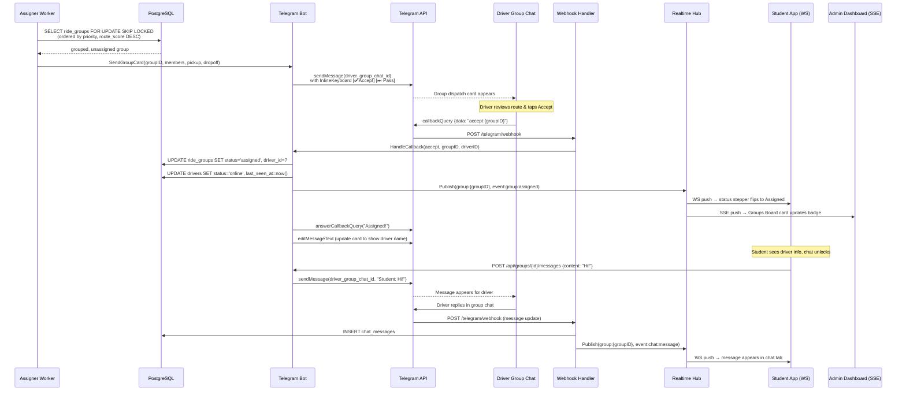
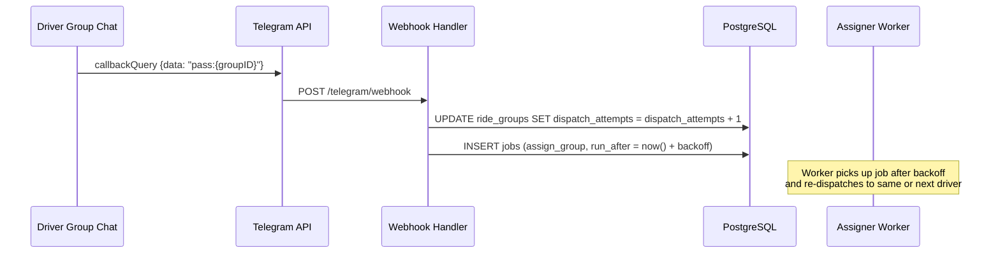

# Marshal — Telegram Dispatch Sequence

The flow from a formed group reaching the Telegram driver channel to the student seeing "Assigned" live.

### Telegram Driver Interface

These screenshots demonstrate the driver UI in Telegram for the dispatch sequence described above.

| Telegram Group Chat | Telegram Personal Chat |
|---|---|
|  |  |

---

<!-- EXCALIDRAW FALLBACK
===================
To convert this to an Excalidraw sequence diagram:

1. Open https://app.excalidraw.com
2. Create participant swimlanes (vertical columns) for:
   Assigner Worker | PostgreSQL | Telegram Bot | Telegram API | Driver Group | Webhook | Realtime Hub | Student App | Admin Dashboard
3. Draw arrows between them following the sequence above
4. Use dashed arrows for async events (SSE/WS pushes)
5. Add a dashed box labelled "Driver taps Accept" around the TG→DG interaction
6. Colour the realtime fan-out arrows (Hub→SA, Hub→AD) in #00ED64 to highlight the live update moment
7. Export as PNG → docs/diagrams/telegram-dispatch.png
8. Export as .excalidraw → docs/diagrams/telegram-dispatch.excalidraw

Then replace this file's Mermaid block with:

-->

---

### Pass Flow

If the driver taps **Pass** instead of Accept:

Backoff increases with `dispatch_attempts` to prevent flooding the driver group.
