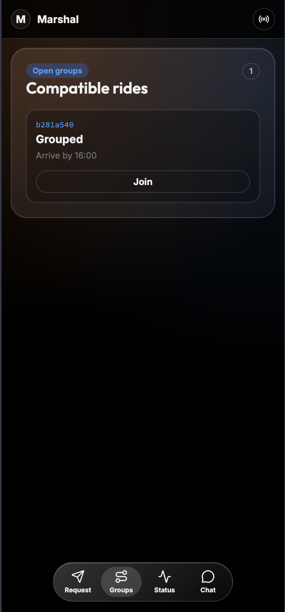
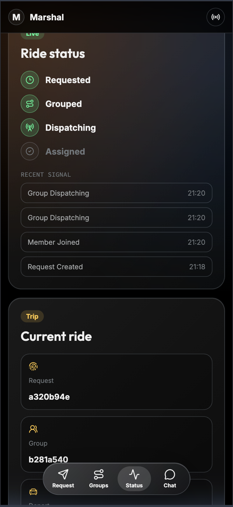
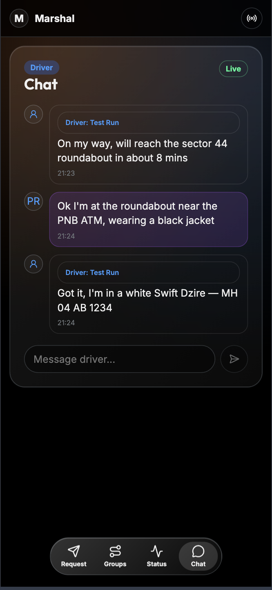

# Marshal — Student App

Mobile-first PWA for students to request rides, track their group in real time, and chat with the assigned driver. Built for phones — liquid-glass bottom tab bar, dark UI throughout.

**Live:** `https://marshal-student.vercel.app` (Vercel)

---

## Screenshots

| Request | Groups | Status | Chat |
|---|---|---|---|
|  |  |  |  |

---

## Tabs

**Request** — name, pickup location (search / saved / coordinates), dropoff location, arrive-by datetime. Location search uses OpenStreetMap Nominatim. Submits `POST /api/requests`.

**Groups** — shows compatible open groups that the student could join. Updates live. Empty state: "No open groups yet. Marshal will surface one when routes line up."

**Status** — live ride status stepper: Requested → Grouped → Dispatching → Assigned. Shows request ID, group ID, departure status, and rider count. Powered by WebSocket connection to `/ws`.

**Chat** — direct message thread between student and assigned driver. Unlocks after a group is assigned. Messages relay bidirectionally through the backend to the Telegram driver group.

---

## Stack

- **Vite 6** + **React 19** + **Tailwind CSS 4**
- Mobile-first: ≤768px breakpoint, bottom tab bar navigation
- WebSocket (`/ws`) for live status and chat
- REST (`useStudentDashboard` hook) for data fetching
- Location: OpenStreetMap Nominatim API
- Lucide React icons

---

## Environment Variables

| Variable | Default (dev) | Description |
|---|---|---|
| `VITE_API_URL` | `http://localhost:8080` | Backend API base URL |
| `PORT` | `5173` | Dev server port |

Copy `.env.example` to `.env.local` for local development.

---

## Local Setup

```bash
cd frontend/student
cp .env.example .env.local
npm install
npm run dev     # → http://localhost:5173
```

The backend must be running on `VITE_API_URL`. See the [backend README](../../backend/README.md).

```bash
npm run build   # production build → dist/
npm run lint    # ESLint
```

---

## Deployment

Deployed to Vercel via Git push. Build settings:

- **Framework preset:** Vite
- **Build command:** `npm run build`
- **Output directory:** `dist`
- **Root directory:** `frontend/student`
- **Environment variable:** `VITE_API_URL=https://marshal-api.onrender.com`

---

## Design Notes

The bottom tab bar uses a frosted-glass pill style (`backdrop-blur`, `bg-white/10`) that renders as a floating island on dark backgrounds — sometimes called the "liquid glass" aesthetic. All four tabs are always visible; the active tab has an opaque pill highlight.

The status stepper icons map directly to the four lifecycle states from the backend model: clock (Requested), group (Grouped), signal (Dispatching), check (Assigned). The "RECENT SIGNAL" label beneath shows the last raw SSE event text for debugging.

Location input supports three modes selectable via a segmented control: free-text Nominatim search, a saved-locations shortlist (currently a placeholder), and raw lat/lng coordinate entry. This was designed to handle campus gates and internal road names that Nominatim sometimes misses.
